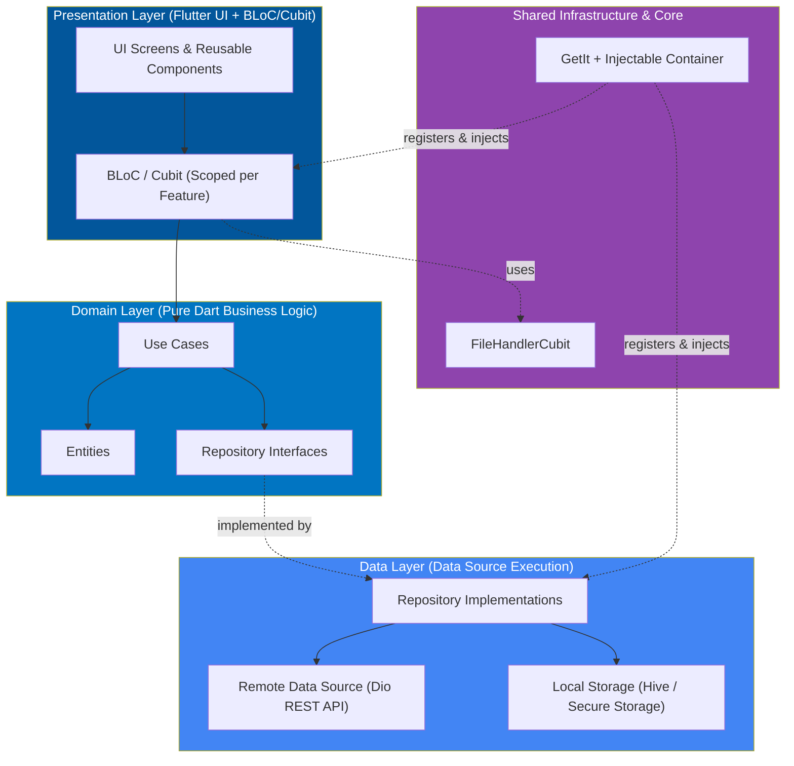
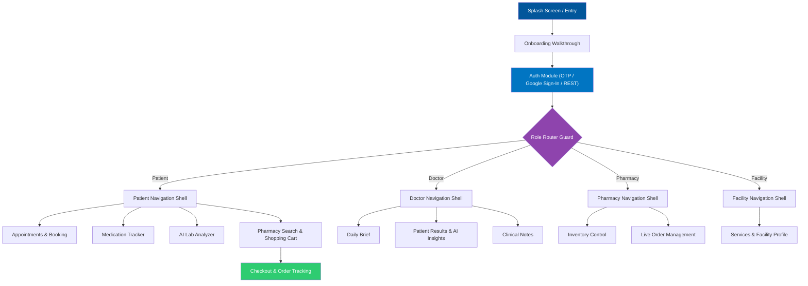

<div align="center">

# 🩺 CHEFAA (شفاء)

### **AI-Powered Multi-Role Healthcare Ecosystem**

*A unified, role-aware mobile application seamlessly connecting Patients, Doctors, Pharmacies, and Healthcare Facilities into one intelligent network.*

[](https://flutter.dev)
[](https://dart.dev)
[](https://bloclibrary.dev)
[]()
[](https://firebase.google.com)
[]()
[]()

---

🎓 **Graduation Project** — *Faculty of Computers and Information, Menoufia University*

</div>

<br>

## 📌 Table of Contents

- [Executive Summary](#-executive-summary)
- [Key Features by Role](#-key-features-by-role)
- [🤖 AI Capabilities](#-ai-capabilities)
- [🏗 Architecture & Design System](#-architecture--design-system)
- [🗺 Application Flow](#-application-flow)
- [🛠 Tech Stack & Dependencies](#-tech-stack--dependencies)
- [📂 Project Directory Structure](#-project-directory-structure)
- [🚀 Getting Started](#-getting-started)
- [👥 Meet the Developers](#-meet-the-developers)

---

## 📖 Executive Summary

**Chefaa** bridges the gap between fragmented healthcare services by bringing all stakeholders—**Patients**, **Doctors**, **Pharmacies**, and **Facilities**—into a single cross-platform ecosystem. 

Rather than maintaining separate applications, Chefaa provides a **dynamic, role-aware navigation and feature layer** built on top of a single, scalable Flutter client. Powered by REST APIs, native Google Maps integration, and AI diagnostic analysis, Chefaa offers a complete end-to-end digital health experience.

### **Core Engineering Highlights**
* **Strict Feature-Based Clean Architecture:** Clear boundaries between Presentation, Domain, Data, and Core/Shared layers.
* **Role-Aware Navigation:** Dynamic routing shell tailored to the authenticated actor (`Patient`, `Doctor`, `Pharmacy`, `Facility`).
* **Shared Cross-Feature Engine:** Single-instance services (e.g., stateful `FileHandlerCubit`) reused across modules without code duplication.
* **Functional Error Handling:** Built using functional programming primitives (`dart_either`) to handle Dio API failures safely and predictably.
* **Full Arabic/English Localization:** Native RTL/LTR directionality support with localized copy and layout adjustments.

---

## ⚡ Key Features by Role

### 👤 Patient Module
* **Smart Dashboard:** Personalized greetings, upcoming appointment trackers, daily medication adherence cards, and quick diagnostic discovery.
* **Appointment & Telehealth Booking:** Multi-step reservation engine (filtering by specialty, consultation fee, date/time picker, and payment processing).
* **Medication Tracker & Schedules:** Automated dosage reminders, schedules, and adherence trackers.
* **Pharmacy & E-Commerce Cart:** Browse nearby pharmacies, search medications, add to cart, and execute dynamic delivery checkout.
* **Labs & Diagnostic Discovery:** Interactive map search to find nearby labs and radiology centers with instant booking options.

### 🩺 Doctor Module
* **Physician Dashboard:** Overview of daily metrics, total consultations, response scores, and patient review analytics.
* **Daily Schedule Briefing:** Real-time agenda view organizing upcoming patient consultations and diagnostic reviews.
* **Patient Case Management:** Review uploaded lab files, read AI-generated health summaries, and attach clinical notes directly to patient profiles.

### 💊 Pharmacy Module
* **Inventory Management:** Real-time stock status, pricing adjustments, and medicine catalog updates.
* **Order Processing Hub:** Streamlined view for incoming prescription/medicine orders with real-time status transitions (Accepted, Preparing, Dispatched, Delivered).

### 🏥 Facility Module
* **Services Directory:** Manage active facility offerings, available equipment, diagnostic tests, and pricing.
* **Facility Dashboard:** Operational insights and patient booking management.

---

## 🤖 AI Capabilities

| Feature | Description | Target User |
| :--- | :--- | :--- |
| **AI Lab Analysis** | Extracts key metrics from uploaded lab reports, flags abnormal values, plots risk indicators on gauge charts, and generates plain-language explanations. | **Patient / Doctor** |
| **Chefaa AI Assistant** | Conversational health assistant capable of answering medication questions, guiding triage steps, or requesting human pharmacist intervention. | **All Roles** |
| **AI-Driven Lab Ranking** | Ranks nearby laboratories and radiology centers by relevance, cost efficiency, quality ratings, and proximity. | **Patient** |
| **Diagnostic Insights Mapping** | Provides doctors with pre-analyzed summary reports alongside patient raw data to speed up clinical evaluation. | **Doctor** |

---

## 🏗 Architecture & Design System

Chefaa is engineered around **Feature-First Clean Architecture**, prioritizing high cohesion and low coupling.



### **Core Technical Decisions**

1. **State Management:** `flutter_bloc` chosen for predictable state transitions, strict separation of side-effects, and ease of unit testing.
2. **Dependency Injection:** `get_it` paired with `injectable` code generation for compile-time safe service locator registration.
3. **Networking Layer:** Interceptor-driven `Dio` instance handling JWT authentication headers, automated token refreshes, and structured error mapping.
4. **Offline & Fast Storage:** `hive` key-value store for caching light app data paired with `flutter_secure_storage` for token persistence.

---

## 🗺 Application Flow



---

## 🛠 Tech Stack & Dependencies

```text
├── Framework & Language:  Flutter (v3.10.8+), Dart
├── State Management:     flutter_bloc, bloc
├── Architecture & DI:     GetIt, Injectable, build_runner
├── Networking:            Dio, dart_either, REST APIs
├── Routing:               GoRouter
├── Local Persistence:     Hive, Hive Flutter, Flutter Secure Storage, Shared Preferences
├── Mapping & Location:    Google Maps Flutter, Geolocator, Geocoding, Widget-to-Marker
├── Charts & Data Visuals: Syncfusion Flutter Gauges, FL Chart
├── Authentication:        Firebase Core, Google Sign In, Email Validator
├── Localizations:         Easy Localization, Intl
└── UI Customization:      Flutter ScreenUtil, Flutter SVG, Dotted Border, Animated Snack Bar

```

---

## 📂 Project Directory Structure

```text
lib/
├── core/                        # App-wide themes, constants, utilities, and network configs
│   ├── network/                # Dio client setups and error handling
│   ├── theme/                  # Color palettes, typography, and light/dark modes
│   └── utils/                  # Formatters, validators, and extensions
│
├── features/                    # Role-based feature modules
│   ├── auth/                   # Shared authentication mechanisms
│   ├── patient/                # Patient domain modules (home, appointment, ai_lab, cart...)
│   ├── doctor/                 # Doctor domain modules (daily_brief, patients, profile...)
│   ├── pharmacy/               # Pharmacy domain modules (inventory, orders...)
│   ├── facility/               # Facility domain modules (services, dashboard...)
│   ├── entry/                  # Role-selection and app start handlers
│   └── onboarding/             # Onboarding carousel screens
│
├── shared/                      # Cross-cutting infrastructure shared across roles
│   └── file_handler/           # Universal document/image picker logic (FileHandlerCubit)
│
├── chefaa.dart                  # Main app configuration root
├── firebase_options.dart        # Auto-generated Firebase configurations
└── main.dart                    # Application entry point

```

---

## 🚀 Getting Started

### Prerequisites

* **Flutter SDK:** `>=3.10.8`
* **Dart SDK:** `>=3.0.0`
* **IDE:** VS Code or Android Studio
* **API Keys:** Google Maps API key configured in `AndroidManifest.xml` and `AppDelegate.swift`.

### Installation & Local Setup

1. **Clone the repository:**
```bash
git clone [https://github.com/your-username/chefaa.git](https://github.com/your-username/chefaa.git)
cd chefaa

```


2. **Install project dependencies:**
```bash
flutter pub get

```


3. **Run code generation (Injectable, Hive, etc.):**
```bash
flutter pub run build_runner build --delete-conflicting-outputs

```


4. **Verify environment setup:**
```bash
flutter doctor

```


5. **Run the application:**
```bash
flutter run

```


---

## 👥 Meet the Developers

This project was engineered as a Graduation Project at the **Faculty of Computers and Information, Menoufia University**.

| **Abdullah Esmail** | **Eng. Eman Medhat** |
| --- | --- |
| Flutter Software Engineer | Software Engineer |
| [GitHub Profile](https://www.google.com/search?q=https://github.com/abdullahesmail) • [LinkedIn](https://www.google.com/search?q=https://linkedin.com/in/abdullahesmail) | [GitHub Profile](https://www.google.com/search?q=https://github.com/emanmedhat) • [LinkedIn](https://www.google.com/search?q=https://linkedin.com/in/emanmedhat) |
