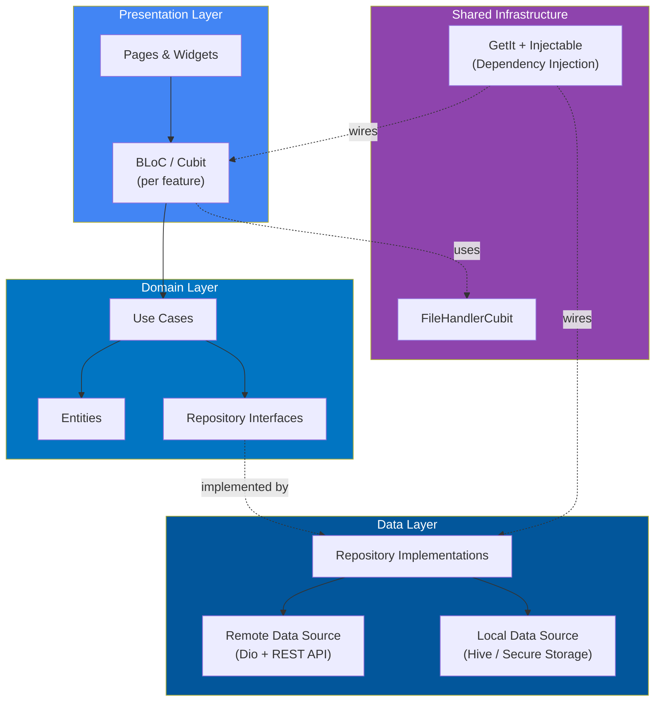
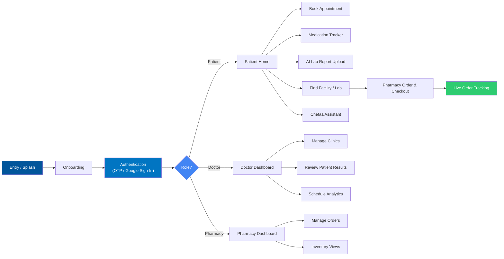

<div align="center">

#  CHEFAA 

### An AI-Assisted Healthcare Super-App — Built with Flutter

*Connecting Patients, Doctors, Pharmacies, and Facilities in one seamless, role-aware mobile experience.*


<br>

**Graduation Project — Faculty of Computers and Information, Menoufia University**

</div>

<br>

##  Table of Contents

- [About the Project](#-about-the-project)
- [Feature Overview](#-feature-overview)
- [AI Capabilities](#-ai-capabilities)
- [Tech Stack](#-tech-stack)
- [Architecture](#-architecture)
- [Application Flow](#-application-flow)
- [API Integration](#-api-integration)
- [Getting Started](#-getting-started)
- [Project Goals](#-project-goals)
- [Team](#-team)

<br>

---

##  About the Project

**Chefaa** is a Flutter mobile application that unifies four healthcare user roles — **Patients, Doctors, Pharmacies, and Facilities** — inside a single, role-aware app. It consumes a REST backend for authentication, appointments, prescriptions, medication tracking, pharmacy ordering, and facility discovery, while layering **AI-assisted features** (lab report analysis, a conversational health assistant, and smart lab recommendations) on top of a fast, clean, and fully localized native experience.

The app follows a **feature-based clean architecture**, with a dedicated module per role, shared infrastructure for cross-cutting concerns like file handling, and dependency injection wiring everything together.

<br>

---

##  Feature Overview

###  Onboarding & Authentication
- Splash / app entry flow with an animated onboarding walkthrough
- Full **Arabic / English** localization
- Registration & login with **OTP verification** and **Google Sign-In**
- Email validation, forgot / reset password, and secure session storage

###  Patient Module
- **Home dashboard** — personalized greeting, quick doctor/specialty search, today's medication status, latest lab results, and upcoming appointments at a glance
- **Appointment booking** — multi-step flow: choose visit type (**in-clinic** or **video call**) → date & time via calendar picker → review consultation fee → pay by **credit card or cash**
- **My Appointments** — track upcoming, completed, and cancelled visits, with cancel / reschedule / join-now actions
- **Medication tracker ("My Medications")** — add medications with dosage, form, and daily dose schedule; monitor **adherence percentage** and get upcoming-dose reminders
- **Medicine catalog** — verified clinical monographs per medicine, including usage instructions (standard dose, dosing interval, 24h limit), clinical indications, and a full chemical profile (ATC classification, bioavailability, plasma half-life, excretion pathway)
- **Document / lab report uploads** — attach JPEG, PNG, PDF, or MP4 files for AI analysis

###  Doctor Module
- Doctor profile dashboard — clinic count, response score, review count, and years of experience at a glance, with profile-completion prompts
- **My Clinics** management — add clinics, track approval status (e.g. *pending*), and see per-day open/closed state
- Bio, degrees & certifications, and direct-contact info management
- **Patient results management** — upload and review patient lab files, read AI-generated health insights, and attach doctor's notes
- Data visualization for schedules and performance analytics

###  Pharmacy Module
- **Pharmacy discovery** — search pharmacies or medicines, filter by *Pharmacies / Medicines / Nearby*, and browse ratings, delivery time, and medicine-catalog size per pharmacy
- **Pharmacy details** — open/closed status, insurance & prescription acceptance, opening hours, average delivery time, and available services (express delivery, prescription preparation, insurance support), plotted on a map
- **Checkout flow** — delivery method selection, delivery-info form, payment method (**cash on delivery** or **online payment**), and an itemized order summary
- **Live order tracking** — real-time delivery progress (confirmed → preparing → picked up → on the way) with delivery-agent details and ETA

###  Facility Discovery
- Map-based facility, clinic, and lab browsing with current-location detection
- Geocoding, location permissions, and custom map markers for facility pins
- **AI-recommended labs** — nearby labs and radiology centers ranked by relevance, with pricing and ratings

###  Shared File Handling
- Centralized file picking & upload state (`FileHandlerCubit`), reused across the Patient, Doctor, and Pharmacy modules for reports, prescriptions, and images

<br>

---

##  AI Capabilities

Chefaa layers AI-assisted tools on top of the core healthcare workflows:

| Feature | What it does |
|---|---|
| **AI Lab Report Analysis** | Parses uploaded lab results, flags abnormal values (e.g. low/normal/high), visualizes overall risk on a gauge chart, and generates a plain-language health summary with actionable next steps |
| **Chefaa Assistant** | An in-app conversational chatbot patients can ask about medications or use to request a live pharmacist, with quick-action shortcuts |
| **AI-Recommended Labs** | Ranks nearby labs/radiology centers by relevance, pricing, and quality when a patient searches for diagnostic services |
| **AI Health Insight (Doctor side)** | Surfaces AI-generated diagnostic mapping alongside uploaded patient results, so doctors can review AI findings next to their own notes |

<br>

---

## 🛠 Tech Stack

| Category | Packages Used |
|---|---|
| **Framework** | Flutter, Dart |
| **State Management** | `flutter_bloc` |
| **Dependency Injection** | `get_it`, `injectable` |
| **Networking** | `dio`, `dart_either` (functional error handling) |
| **Routing** | `go_router` |
| **Local Storage** | `shared_preferences`, `flutter_secure_storage`, `hive`, `hive_flutter` |
| **Firebase** | `firebase_core` |
| **Authentication** | `google_sign_in`, `email_validator`, `flutter_otp_text_field` |
| **Maps & Location** | `google_maps_flutter`, `geolocator`, `geocoding`, `permission_handler`, `widget_to_marker` |
| **Charts & Data Viz** | `fl_chart`, `syncfusion_flutter_gauges` |
| **Scheduling** | `syncfusion_flutter_datepicker` |
| **File Handling** | `file_picker` |
| **UI & UX** | `flutter_screenutil`, `flutter_svg`, `dotted_border`, `animated_snack_bar`, `animated_toggle`, `material_symbols_icons`, `flutter_markdown`, `cupertino_icons` |
| **Localization** | `easy_localization`, `intl` |
| **Splash & Icons** | `flutter_native_splash`, `flutter_launcher_icons` |
| **Code Generation** | `build_runner`, `injectable_generator`, `hive_generator` |

<br>

---

## 🏗 Architecture

Chefaa follows a **feature-based clean architecture**, with one module per user role and shared infrastructure kept separate from feature logic.

```text
lib/
├── core/
│
├── features/
│   ├── auth/
│   ├── doctor/
│   ├── entry/
│   │   └── presentation/
│   │       └── pages/
│   ├── facility/
│   ├── onboarding/
│   ├── patient/
│   └── pharmacy/
│
├── shared/
│   └── file_handler/
│       └── presentation/
│           └── manager/
│               ├── file_handler_cubit.dart
│               └── file_handler_state.dart
│
├── chefaa.dart
├── firebase_options.dart
└── main.dart
```

### Layered View



### State Management

State is managed with **BLoC/Cubit** (`flutter_bloc`), scoped per feature. Shared, cross-feature logic — like file uploads used across the Patient, Doctor, and Pharmacy modules — lives in `shared/`, so it isn't duplicated per role.

`FileHandlerCubit`, for example, centralizes file picking and upload state (`file_handler_cubit.dart` / `file_handler_state.dart`), and is reused wherever a screen needs to attach documents, reports, or images.

Dependencies are wired through **GetIt** and **Injectable**, with code generation handled by `build_runner`.

<br>

---

##  Application Flow



<br>

---

##  API Integration

The app communicates with the Chefaa backend over REST, using **Dio** for networking and `dart_either` to model success/failure results cleanly through the data and domain layers. Firebase (`firebase_core`) is initialized via `firebase_options.dart`, laying the groundwork for platform services such as push notifications.

<br>

---

##  Getting Started

### Prerequisites

- Flutter SDK `^3.10.8`
- A configured Firebase project (`firebase_options.dart` is already generated via FlutterFire CLI)

Verify your Flutter installation:

```bash
flutter doctor
```

### Installation

**1. Clone the repository**

```bash
git clone https://github.com/your-username/chefaa.git
```

**2. Navigate into the project**

```bash
cd chefaa
```

**3. Install dependencies**

```bash
flutter pub get
```

**4. Generate injectable / hive code**

```bash
flutter pub run build_runner build --delete-conflicting-outputs
```

**5. Run the app**

```bash
flutter run
```

<br>

---

##  Project Goals

This project was built to:

- Build a complete, role-based healthcare app using Flutter
- Practice scalable state management with BLoC/Cubit across multiple user roles
- Structure shared logic (like file handling) separately from per-role features
- Integrate maps and location services for real-world facility discovery
- Layer AI-assisted tools (lab analysis, chat assistant, smart recommendations) onto core healthcare workflows
- Apply dependency injection and code generation for a maintainable codebase
- Support full localization across the app
- Apply clean, feature-based architecture end to end

<br>

---

##  License

This project was developed as a **Graduation Project** at the Faculty of Computers and Information, Menoufia University.

<br>

---

<div align="center">

##  Team

**Abdullah Esmail & Eman Medhat**

*Flutter Developers | Computer Science Graduates*

</div>
