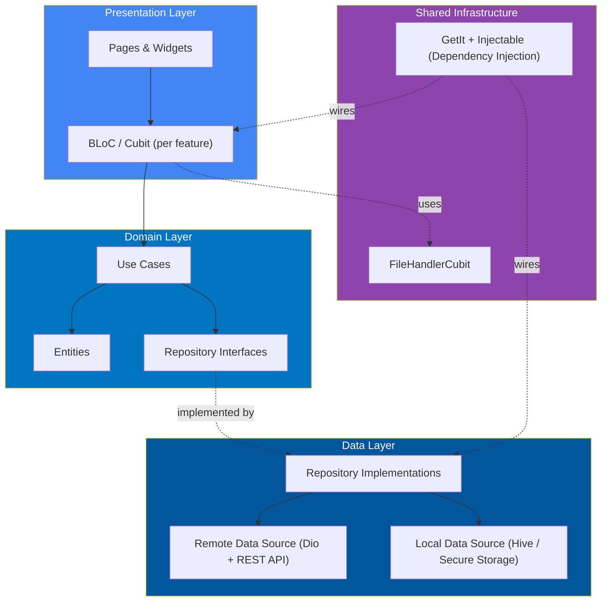
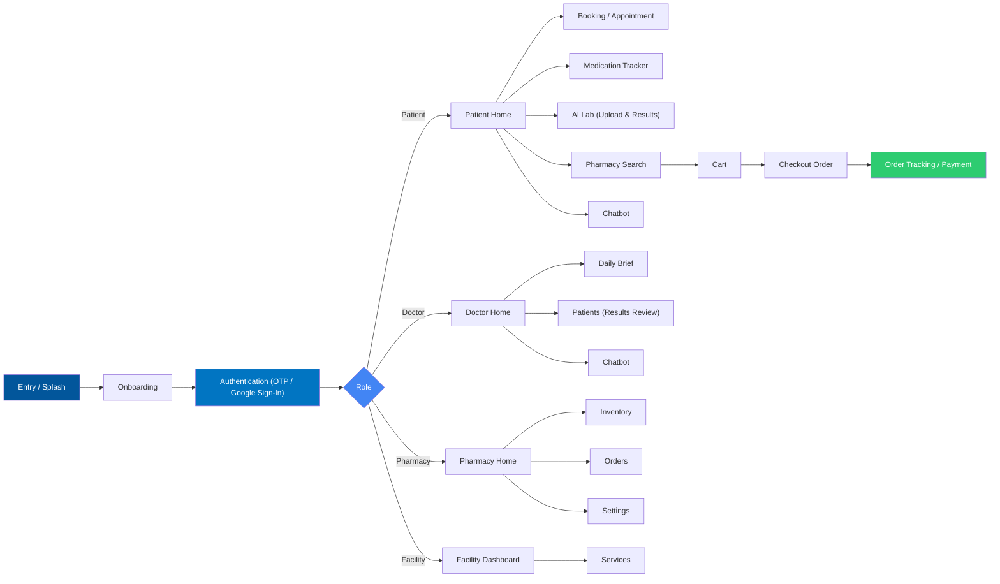

<div align="center">

# CHEFAA 

### An AI-Assisted Healthcare Platform Built with Flutter

Connecting Patients, Doctors, Pharmacies, and Facilities in one unified, role-based mobile application.


<br>

**Graduation Project — Faculty of Computers and Information, Menoufia University**

</div>

<br>

---

## About the Project

Chefaa is a Flutter mobile application that unifies four healthcare user roles — Patients, Doctors, Pharmacies, and Facilities — inside a single, role-aware app. It consumes a REST backend for authentication, appointments, prescriptions, medication tracking, pharmacy ordering, and facility discovery, and layers AI-assisted features — lab report analysis, a conversational health assistant, and smart lab recommendations — on top of a fast, clean, and fully localized native experience.

The application follows a feature-based clean architecture. Each role (Patient, Doctor, Pharmacy, Facility) is implemented as an independent set of feature modules under `lib/features/`, with shared infrastructure for cross-cutting concerns such as file handling, and dependency injection wiring the layers together.

<br>

---

## Feature Overview

### Onboarding & Authentication
- Splash and app-entry flow with an onboarding walkthrough
- Full Arabic / English localization
- Registration and login with OTP verification and Google Sign-In
- Email validation, forgot / reset password, and secure session storage
- A dedicated `auth` module exists inside every role (`patient`, `doctor`, `pharmacy`, `facility`), alongside a shared `complete_auth_data` step for finishing account setup after sign-up

### Patient Module
The patient role is the most extensive module in the codebase, organized into the following feature areas:

| Module | Responsibility |
|---|---|
| `home` | Personalized dashboard — greeting, quick doctor/specialty search, today's medication status, latest lab results, and upcoming appointments |
| `appointment` / `booking` | Multi-step appointment booking (visit type, date/time, consultation fee, payment) and appointment history management |
| `medication` | Medication tracker with dosage, form, schedule, and adherence tracking |
| `ai_lab` / `lab_results` / `lab_search` | AI-powered lab report upload and analysis, plus discovery of nearby labs and radiology centers |
| `pharmacy` / `search` | In-app pharmacy and medicine discovery |
| `cart` | Shopping cart for medicine orders |
| `checkout_order` | Delivery details, payment method selection, and order confirmation |
| `order` / `payment` | Order tracking and payment processing |
| `chatbot` | The Chefaa Assistant conversational AI |
| `notification` | In-app notifications and alerts |
| `profile` | Patient profile and account management |
| `layout` | Shared navigation shell and page scaffolding for the patient role |

### Doctor Module
| Module | Responsibility |
|---|---|
| `home` | Doctor dashboard — clinic count, response score, review count, and years of experience, with profile-completion prompts |
| `daily_brief` | A daily summary view for the doctor's schedule and priorities |
| `patients` | Patient results management — uploading and reviewing lab files, reading AI-generated health insights, and attaching doctor's notes |
| `chatbot` | AI assistant support on the doctor side |
| `profile` | Bio, degrees and certifications, and direct-contact information management |
| `layout` | Shared navigation shell for the doctor role |

### Pharmacy Module
| Module | Responsibility |
|---|---|
| `home` | Pharmacy dashboard overview |
| `inventory` | Medicine inventory management |
| `orders` | Incoming order management and live order-status updates |
| `chatbot` | AI assistant support on the pharmacy side |
| `profile` | Pharmacy profile, hours, and contact details |
| `settings` | Pharmacy account and app settings |
| `layout` | Shared navigation shell for the pharmacy role |

### Facility Module
| Module | Responsibility |
|---|---|
| `dashboard` | Facility overview dashboard |
| `services` | Management of facility services and offerings |
| `profile` | Facility profile and details |
| `layout` | Shared navigation shell for the facility role |

Facility and lab locations are additionally surfaced through map-based discovery, with current-location detection, geocoding, location permissions, and custom map markers.

### Shared File Handling
- Centralized file picking and upload state (`FileHandlerCubit`), reused across the Patient, Doctor, and Pharmacy modules for reports, prescriptions, and images

<br>

---

## AI Capabilities

| Feature | Description |
|---|---|
| AI Lab Report Analysis | Parses uploaded lab results, flags abnormal values, visualizes overall risk on a gauge chart, and generates a plain-language health summary with recommended next steps |
| Chefaa Assistant | An in-app conversational chatbot — available to patients, doctors, and pharmacies — used to ask about medications, request a live pharmacist, or get quick support |
| AI-Recommended Labs | Ranks nearby labs and radiology centers by relevance, pricing, and quality when a patient searches for diagnostic services |
| AI Health Insight (Doctor Side) | Surfaces AI-generated diagnostic mapping alongside uploaded patient results, allowing doctors to review AI findings next to their own notes |

<br>

---

## Tech Stack

| Category | Packages Used |
|---|---|
| Framework | Flutter, Dart |
| State Management | `flutter_bloc` |
| Dependency Injection | `get_it`, `injectable` |
| Networking | `dio`, `dart_either` (functional error handling) |
| Routing | `go_router` |
| Local Storage | `shared_preferences`, `flutter_secure_storage`, `hive`, `hive_flutter` |
| Firebase | `firebase_core` |
| Authentication | `google_sign_in`, `email_validator`, `flutter_otp_text_field` |
| Maps & Location | `google_maps_flutter`, `geolocator`, `geocoding`, `permission_handler`, `widget_to_marker` |
| Charts & Data Visualization | `fl_chart`, `syncfusion_flutter_gauges` |
| Scheduling | `syncfusion_flutter_datepicker` |
| File Handling | `file_picker` |
| UI & UX | `flutter_screenutil`, `flutter_svg`, `dotted_border`, `animated_snack_bar`, `animated_toggle`, `material_symbols_icons`, `flutter_markdown`, `cupertino_icons` |
| Localization | `easy_localization`, `intl` |
| Splash & Icons | `flutter_native_splash`, `flutter_launcher_icons` |
| Code Generation | `build_runner`, `injectable_generator`, `hive_generator` |

<br>

---

## Project Structure

```text
lib/
├── core/
│
├── features/
│   ├── auth/
│   │
│   ├── patient/
│   │   ├── auth/
│   │   ├── complete_auth_data/
│   │   ├── home/
│   │   ├── appointment/
│   │   ├── booking/
│   │   ├── medication/
│   │   ├── ai_lab/
│   │   ├── lab_results/
│   │   ├── lab_search/
│   │   ├── pharmacy/
│   │   ├── search/
│   │   ├── cart/presentation/
│   │   ├── checkout_order/presentation/
│   │   ├── order/
│   │   ├── payment/
│   │   ├── chatbot/
│   │   ├── notification/
│   │   ├── profile/
│   │   └── layout/presentation/pages/
│   │
│   ├── doctor/
│   │   ├── auth/
│   │   ├── home/
│   │   ├── daily_brief/
│   │   ├── patients/
│   │   ├── chatbot/
│   │   ├── profile/
│   │   └── layout/
│   │
│   ├── pharmacy/
│   │   ├── auth/
│   │   ├── home/presentation/
│   │   ├── inventory/
│   │   ├── orders/presentation/
│   │   ├── chatbot/
│   │   ├── profile/
│   │   ├── settings/
│   │   └── layout/presentation/pages/
│   │
│   ├── facility/
│   │   ├── auth/
│   │   ├── dashboard/
│   │   ├── services/
│   │   ├── profile/
│   │   └── layout/presentation/
│   │
│   ├── entry/
│   │   └── presentation/
│   │       └── pages/
│   │
│   └── onboarding/
│
├── shared/
│   └── file_handler/
│       └── presentation/
│           └── manager/
│               ├── file_handler_cubit.dart
│               └── file_handler_state.dart
│
├── chefaa.dart
├── firebase_options.dart
└── main.dart
```

Every role under `features/` is structured consistently: an `auth` module for role-specific sign-in, a `layout` module for the shared navigation shell, a `profile` module for account management, and a set of domain modules specific to that role (for example, `medication` and `checkout_order` for patients, `daily_brief` and `patients` for doctors, `inventory` and `orders` for pharmacies, and `dashboard` and `services` for facilities). `core/` holds app-wide utilities and configuration — theming, constants, network setup, and error handling — while `shared/` holds cross-feature logic, such as the file handler used by the Patient, Doctor, and Pharmacy modules, so it is implemented once and reused rather than duplicated per role.

<br>

---

## Architecture

Chefaa follows a feature-based clean architecture, with one set of modules per user role and shared infrastructure kept separate from feature logic.



### State Management

State is managed with BLoC/Cubit (`flutter_bloc`), scoped per feature module. Shared, cross-feature logic — such as file uploads used across the Patient, Doctor, and Pharmacy modules — lives in `shared/`, so it is not duplicated per role.

`FileHandlerCubit`, for example, centralizes file picking and upload state (`file_handler_cubit.dart` / `file_handler_state.dart`) and is reused wherever a screen needs to attach documents, reports, or images.

Dependencies are wired through GetIt and Injectable, with code generation handled by `build_runner`.

<br>

---

## Application Flow



<br>

---

## API Integration

The application communicates with the Chefaa backend over REST, using Dio for networking and `dart_either` to model success/failure results cleanly through the data and domain layers. Firebase (`firebase_core`) is initialized via `firebase_options.dart`, laying the groundwork for platform services such as push notifications.

<br>

---

## Getting Started

### Prerequisites

- Flutter SDK `^3.10.8`
- A configured Firebase project (`firebase_options.dart` is already generated via the FlutterFire CLI)

Verify your Flutter installation:

```bash
flutter doctor
```

### Installation

**1. Clone the repository**

```bash
git clone https://github.com/your-username/chefaa.git
```

**2. Navigate into the project**

```bash
cd chefaa
```

**3. Install dependencies**

```bash
flutter pub get
```

**4. Generate injectable / hive code**

```bash
flutter pub run build_runner build --delete-conflicting-outputs
```

**5. Run the application**

```bash
flutter run
```

<br>

---

## Project Goals

This project was built to:

- Build a complete, role-based healthcare application using Flutter
- Practice scalable state management with BLoC/Cubit across multiple user roles
- Structure a large codebase into consistent, self-contained feature modules per role
- Structure shared logic, such as file handling, separately from per-role features
- Integrate maps and location services for real-world facility discovery
- Layer AI-assisted tools — lab analysis, a chat assistant, and smart recommendations — onto core healthcare workflows
- Apply dependency injection and code generation for a maintainable codebase
- Support full localization across the application
- Apply clean, feature-based architecture end to end

<br>

---

## License

This project was developed as a Graduation Project at the Faculty of Computers and Information, Menoufia University.

<br>

---

<div align="center">

## Team

**Abdullah Esmail & Eman Medhat**

Flutter Developers | Computer Science Graduates

</div>
