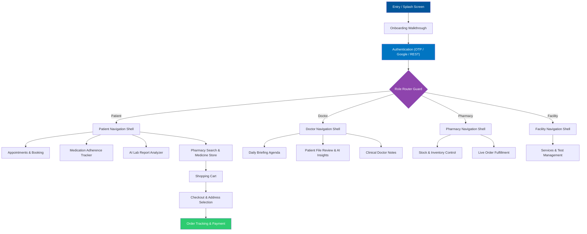

<div align="center">

# 🩺 CHEFAA (شفاء)

### **AI-Powered Multi-Role Healthcare Ecosystem**

*A unified, role-aware cross-platform mobile application seamlessly connecting Patients, Doctors, Pharmacies, and Healthcare Facilities into one intelligent network.*

[](https://flutter.dev)
[](https://dart.dev)
[](https://bloclibrary.dev)
[]()
[](https://firebase.google.com)
[]()
[]()

---

🎓 **Graduation Project** — *Faculty of Computers and Information, Menoufia University*

</div>

<br>

## 📖 Executive Summary

**Chefaa** bridges the gap between fragmented healthcare services by bringing all four primary stakeholders—**Patients**, **Doctors**, **Pharmacies**, and **Healthcare Facilities**—into a single cross-platform ecosystem.

Instead of maintaining four distinct client applications, Chefaa utilizes a **dynamic, role-aware architecture** built on top of a single, scalable Flutter client. The app consumes REST APIs, integrates Google Maps for location-based medical discovery, and layers conversational and analytical AI capabilities over daily healthcare workflows.

### **Core Engineering Highlights**
* **Strict Feature-First Clean Architecture:** Domain logic is entirely isolated from UI components and external infrastructure.
* **Role-Aware Dynamic Shell:** Navigation bars, dashboards, and available routes dynamically adapt based on the authenticated actor (`Patient`, `Doctor`, `Pharmacy`, `Facility`).
* **Cross-Feature Stateful Infrastructure:** Centralized shared state handlers (e.g., `FileHandlerCubit`) eliminate code duplication across document, prescription, and image uploading screens.
* **Predictable & Safe Network Layer:** Built using `Dio` interceptors and functional error handling (`dart_either`) to guarantee type-safe failure management.
* **Complete Native Localization:** Dynamic Arabic/English layout switching with full Right-to-Left (RTL) and Left-to-Right (LTR) directionality support.

---

## 🏗 System Architecture & Design Patterns

Chefaa is engineered around **Feature-First Clean Architecture**, separating each user role into isolated domain boundaries while providing common app-wide services under `core/` and `shared/`.


### Key Technical Decisions

1. **State Management (`flutter_bloc`):** Guarantees predictable state machines, strict separation of side-effects, and high unit-test coverage.
2. **Dependency Injection (`get_it` + `injectable`):** Eliminates boilerplate with automated compile-time service registration.
3. **Networking (`dio` + `dart_either`):** Features JWT auto-injection, refresh token interception, and functional error handling (`Either<Failure, Success>`).
4. **Data Persistence (`hive` & `flutter_secure_storage`):** Offline caching of lightweight assets with encrypted token storage.

---

## ⚡ Comprehensive Feature Breakdown by Role

### 1. Shared Authentication & Onboarding

* **Entry Walkthrough:** Visual onboarding carousel detailing key platform features.
* **Role Selection Guard:** Router routes users to their role-specific dashboard upon login.
* **Authentication Options:** Email/Password authentication, OTP SMS verification, and native Google Sign-In.
* **Profile Setup (`complete_auth_data`):** Specialized post-registration wizard collecting role-specific metadata (medical license numbers, pharmacy registration details, patient age/blood type).

---

### 2. Patient Module

The Patient portal forms the largest feature set within Chefaa:

* 🏠 **Home Dashboard:** Personalized greeting, medical specialty quick-search, daily medication compliance tracker, recent lab results card, and upcoming appointment summaries.
* 📅 **Appointment Booking System:** Multi-step reservation engine filtering by specialty, doctor fee, availability slot, consultation type (In-person vs. Telehealth), and checkout payment.
* 💊 **Medication Tracker:** Smart pill counter tracking dosage amounts, schedules, frequencies, and adherence history.
* 🧪 **AI Lab Report Analyzer (`ai_lab` / `lab_results`):** Optical data parsing of medical reports, interactive gauge chart risk visualization, and plain-language medical summaries.
* 🗺 **Labs & Radiology Discovery (`lab_search`):** Interactive map interface powered by Google Maps to find nearby accredited diagnostic centers.
* 🛒 **Pharmacy E-Commerce & Checkout:** Search medications, add items to a dynamic shopping cart, enter delivery addresses, and track active orders (`checkout_order`, `order`, `payment`).
* 🤖 **Chefaa Assistant (`chatbot`):** Conversational AI chatbot providing medical guidance, drug lookup, or live pharmacist connections.

---

### 3. Doctor Module

Designed for efficiency and clinical decision-making:

* 📊 **Doctor Dashboard:** Overview of connected clinic profiles, response rates, overall rating, and total patient reviews.
* 🗓 **Daily Brief:** Real-time agenda listing scheduled patient visits, consultation priorities, and appointment statuses for the day.
* 📂 **Patient Management (`patients`):** Review patient uploaded diagnostic files, read system-generated AI risk insights, and attach doctor clinical notes directly to patient charts.
* 🤖 **Doctor AI Assistant:** Diagnostic helper providing quick cross-references for symptoms and medicine interactions.

---

### 4. Pharmacy Module

Targeted at streamlining medicine supply chain operations:

* 📦 **Inventory Management:** Full stock tracking interface enabling real-time adjustments to medicine prices, available quantities, and item status.
* 🚚 **Order Processing Hub:** Incoming patient order queue supporting live status transitions (`Pending` ➔ `Accepted` ➔ `Preparing` ➔ `Dispatched` ➔ `Delivered`).
* 🤖 **Pharmacy Chatbot:** Assistant providing automated client support and inventory lookups.

---

### 5. Facility & Diagnostics Module

Operational hub for healthcare centers, radiology clinics, and laboratories:

* 🏥 **Facility Overview Dashboard:** Performance overview, incoming diagnostic appointment requests, and resource management.
* 🛠 **Services Management:** Add, edit, or toggle facility service offerings, available lab tests, pricing, and operational hours.
* 📍 **Map Geocoding & Discovery:** Custom map markers and geolocation integration to ensure accurate patient navigation to facility locations.

---

## 🤖 AI Capabilities

| AI Feature | Functional Description | Applied Users |
| --- | --- | --- |
| **AI Lab Report Parser** | Analyzes uploaded lab result images/PDFs, flags out-of-range metrics, visualizes health risks on Syncfusion gauge charts, and outputs simplified summaries. | **Patients / Doctors** |
| **Chefaa AI Assistant** | Conversational chat interface capable of handling medication queries, guiding initial triage steps, and escalating requests to live pharmacists. | **All Roles** |
| **AI-Recommended Diagnostic Centers** | Ranks nearby laboratories and radiology centers by proximity, pricing, customer reviews, and service matching. | **Patients** |
| **Doctor Diagnostic Assistant** | Pairs raw patient data with pre-calculated AI medical summaries to streamline clinical evaluations. | **Doctors** |

---

## 🗺 Application Flowchart



---

## 🛠 Exhaustive Tech Stack & Package Matrix

| Category | Packages / Tools | Purpose in Chefaa |
| --- | --- | --- |
| **Framework & Language** | `Flutter (v3.10.8+)`, `Dart` | Cross-platform mobile development |
| **State Management** | `flutter_bloc`, `bloc` | Feature-scoped state management and business logic |
| **Dependency Injection** | `get_it`, `injectable` | Automatic compile-time service locator registration |
| **Networking & API** | `dio`, `dart_either` | Interceptor-driven HTTP requests with functional error handling |
| **Routing** | `go_router` | Declarative, role-based navigation and route guards |
| **Local Storage** | `shared_preferences`, `flutter_secure_storage`, `hive`, `hive_flutter` | Caching session states, user preferences, and encrypted JWT storage |
| **Firebase Services** | `firebase_core` | App initialization and platform services infrastructure |
| **Authentication** | `google_sign_in`, `email_validator`, `flutter_otp_text_field` | Federated auth, email validation, and SMS OTP input fields |
| **Maps & Location** | `google_maps_flutter`, `geolocator`, `geocoding`, `permission_handler`, `widget_to_marker` | Interactive maps, location permissions, geocoding, and custom map pins |
| **Charts & Analytics** | `fl_chart`, `syncfusion_flutter_gauges` | Medical lab risk visualization and dashboard graphs |
| **Scheduling** | `syncfusion_flutter_datepicker` | Interactive appointment date and slot reservation |
| **File Handling** | `file_picker` | Unified multi-format document and image upload handler |
| **UI Components & UX** | `flutter_screenutil`, `flutter_svg`, `dotted_border`, `animated_snack_bar`, `animated_toggle`, `material_symbols_icons`, `flutter_markdown`, `cupertino_icons` | Responsive sizing, icons, custom animations, and markdown chat rendering |
| **Localization** | `easy_localization`, `intl` | Dynamic Arabic and English translation switching |
| **App Branding** | `flutter_native_splash`, `flutter_launcher_icons` | Splash screens and dynamic platform app icons |
| **Code Generation** | `build_runner`, `injectable_generator`, `hive_generator` | Code generation for dependency injection and local databases |

---

## 📂 Full Project Directory Structure

```text
lib/
├── core/                                 # Central utilities, theme data, network, and constants
│   ├── constants/                       # Assets, API endpoints, and storage keys
│   ├── network/                         # Dio instance, interceptors, and network failures
│   ├── theme/                           # Color swatches, typography, and light/dark modes
│   └── utils/                           # Validators, formatters, and extensions
│
├── features/                            # Feature-first modularized application logic
│   ├── auth/                            # Global auth features
│   ├── entry/                           # Role router and splash initialization
│   ├── onboarding/                      # App introduction flow
│   │
│   ├── patient/                         # Patient Role Module
│   │   ├── ai_lab/                      # AI lab report analyzer
│   │   ├── appointment/                 # Appointment listings and details
│   │   ├── auth/                        # Patient-specific sign up/in
│   │   ├── booking/                     # Multi-step booking engine
│   │   ├── cart/                        # Shopping cart management
│   │   ├── chatbot/                     # Chefaa AI assistant
│   │   ├── checkout_order/              # Order checkout and payment selection
│   │   ├── complete_auth_data/          # Post-signup patient setup
│   │   ├── home/                        # Patient main dashboard
│   │   ├── lab_results/                 # Diagnostic report history
│   │   ├── lab_search/                  # Map-based diagnostic center search
│   │   ├── layout/                      # Patient navigation shell
│   │   ├── medication/                  # Pill tracker and adherence schedules
│   │   ├── notification/                # In-app user notifications
│   │   ├── order/                       # Order history tracking
│   │   ├── payment/                     # Payment processing integrations
│   │   ├── pharmacy/                    # In-app pharmacy storefront
│   │   ├── profile/                     # Patient profile settings
│   │   └── search/                      # Global patient search
│   │
│   ├── doctor/                          # Doctor Role Module
│   │   ├── auth/                        # Physician login/signup
│   │   ├── chatbot/                     # Doctor AI helper
│   │   ├── daily_brief/                 # Daily consultation agenda
│   │   ├── home/                        # Doctor main dashboard
│   │   ├── layout/                      # Doctor navigation shell
│   │   ├── patients/                    # Patient lab review and notes
│   │   └── profile/                     # Professional credentials management
│   │
│   ├── pharmacy/                        # Pharmacy Role Module
│   │   ├── auth/                        # Pharmacy authentication
│   │   ├── chatbot/                     # Pharmacy AI assistant
│   │   ├── home/                        # Pharmacy main overview
│   │   ├── inventory/                   # Stock and price controller
│   │   ├── layout/                      # Pharmacy navigation shell
│   │   ├── orders/                      # Fulfillment and dispatch queue
│   │   ├── profile/                     # Pharmacy details & operating hours
│   │   └── settings/                    # Account configuration
│   │
│   └── facility/                        # Facility Role Module
│       ├── auth/                        # Facility credential auth
│       ├── dashboard/                   # Facility operational metrics
│       ├── layout/                      # Facility navigation shell
│       ├── profile/                     # Location and profile setup
│       └── services/                    # Offered medical test catalog
│
├── shared/                              # Shared features reused across roles
│   └── file_handler/                    # Document/image picker logic
│       └── presentation/
│           └── manager/
│               ├── file_handler_cubit.dart
│               └── file_handler_state.dart
│
├── chefaa.dart                          # Root MaterialApp widget and routing setup
├── firebase_options.dart                # Generated Firebase platform configurations
└── main.dart                            # Application entry point

```

---

## 🚀 Getting Started & Local Setup

### Prerequisites

1. **Flutter SDK:** Version `>=3.10.8` installed and added to PATH.
2. **Dart SDK:** Version `>=3.0.0`.
3. **IDE:** VS Code or Android Studio with Flutter/Dart plugins installed.
4. **API Keys:** Add your Google Maps API Key in:
* `android/app/src/main/AndroidManifest.xml`
* `ios/Runner/AppDelegate.swift`


### Step-by-Step Installation

1. **Clone the repository:**
```bash
git clone [https://github.com/your-username/chefaa.git](https://github.com/your-username/chefaa.git)
cd chefaa

```


2. **Fetch dependencies:**
```bash
flutter pub get

```


3. **Execute code generation (Injectable, Hive, etc.):**
```bash
flutter pub run build_runner build --delete-conflicting-outputs

```


4. **Run environment diagnostics:**
```bash
flutter doctor

```


5. **Launch the app:**
```bash
flutter run

```


---

## 🎯 Project Goals & Architectural Impact

Chefaa was engineered to demonstrate high-level software engineering principles applied to real-world medical workflows:

* **Role-Based Scalability:** Demonstrating how complex multi-role systems can exist inside a single client codebase without coupling features.
* **Cohesive Code Isolation:** Using Feature-First Clean Architecture so changes in one role do not impact another.
* **Unified State Management:** Reusing shared infrastructure (like `FileHandlerCubit`) across disparate domains to maintain DRY (Don't Repeat Yourself) principles.
* **Real-World Integrations:** Combining REST networking, maps/location APIs, native local storage, dynamic localized UI, and AI-driven data interpretation into a single experience.

---

## 👥 Meet the Developers

This application was engineered as a Graduation Project at the **Faculty of Computers and Information, Menoufia University**.

| **Eng. Abdullah Esmail and Eng. Eman Medhat** |
